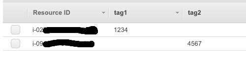
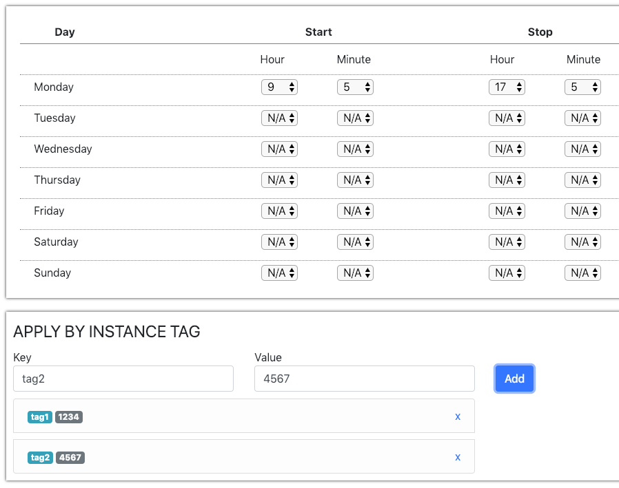

# AWS Schedular

AWS scheduler is a Django(Python) based web application that can be used to  
configure custom start and stop schedules of Amazon EC2 instances.

#### Tech Stacks
Python, Django 2.1.4, Celery, Rabbitmq

###  What you'll need before starting

An AWS account: You will need an AWS account to begin provisioning resources.

Skill level: Working knowledge of Django/Ruby on Rails and Docker & Docker-compose.


### Prerequisites

#### Install Docker & Docker-compose
I have used version `docker-compose version 1.23.2`. However, previous version of Docker compose may work. 
```
docker-compose -v
docker-compose version 1.23.2, build 1110ad01

```
#### Get your Access Key and Secret access key from AWS
https://console.aws.amazon.com/iam/home?region=us-east-2#/security_credentials

### Setup

#####  1 ) Rename `.env_sample` to `.env`

Then add your access key in `.env` file
(In production, use [role](https://docs.aws.amazon.com/IAM/latest/UserGuide/id_roles.html) instead of access key)

```
AWS_ACCESS_KEY_ID=<YOUR ACCESS KEY>
AWS_SECRET_ACCESS_KEY=<YOUR SECRET KEY>

```
For instance, If you AWS_ACCESS_KEY_ID is `XYZ` and AWS_SECRET_ACCESS_KEY is `ABC`
It will be like
```
AWS_ACCESS_KEY_ID=XYZ
AWS_SECRET_ACCESS_KEY=ABC
```


##### 2 ) Set timezone to local time

In `Dockerfile`, set your timezone.
```
ENV TZ=<YOUR TIMEZONE>
```

In `aws_scheduler/settings.py`, set your timezone

```
TIME_ZONE = <YOUR TIMEZONE>
```

Example

```
ENV TZ=Australia/Adelaide
TIME_ZONE = 'Australia/Adelaide'
```
List of [timezones](Timezone_list.txt)

##### 3) Run Docker

```
cd aws_scheduler
docker-compose up
```


## Configure Scheduler

##### 1) Add Tags to EC2 instances
You control which instances are started and stopped by tagging your instances.
You need to tag each EC2 instance you want to be started and stopped according to the schedule. 
To do this find your EC2 instance in the console, click tags, and add tag/s.

Example

ie. You have two EC2 instances on us-east-2. 

Go to Tags -> Manage Tags

https://us-east-2.console.aws.amazon.com/ec2/v2/home?region=us-east-2#manage-tags


##### 2) Login to AWS Scheduler

```
http://0.0.0.0:8000
```

username: admin

password: admin

To change password, go to

```
http://0.0.0.0:8000/admin

```

##### 3) Create scheduler 

Click `Add Schedule` button to add a schedule.

##### 4) Add tags to schedule
ie. You want to start an instance on Monday at 9:05 AM and stop at 5:05 pm.


Then click save schedule

That's it!

### Advanced configuration

AWs scheduler runs three cron jobs

##### 1) sync-with-aws
It synchronises local database with AWS. It gets all the instances that match the
tags. By default it runs every hour.


##### 2) start-sc2-instances 
It starts all instances according to schedule & tag/s. By default, it runs every 5 minutes.


##### 3) stop-ec2-instances
It stops all instances according to schedule & tag/s. By default, it runs every 5 minutes.

#### Change the default settings

To change the default setting, go to `aws_scheduler/settings.py` and change 

` 'schedule': crontab(...)` line.


```
CELERY_BEAT_SCHEDULE = {
    'sync-with-aws': {
        'task': 'scheduler.tasks.get_ec2_by_tags',
        'schedule': crontab(minute='0', hour='*'),
    },
    'start-sc2-instances': {
        'task': 'scheduler.tasks.start_ec2_ins',
        'schedule': crontab(minute='*/5', hour='*'),
    },
    'stop-ec2-instances': {
        'task': 'scheduler.tasks.stop_ec2_ins',
        'schedule': crontab(minute='*/5', hour='*'),
    },

}

``` 

Helpful links:

http://docs.celeryproject.org/en/latest/userguide/periodic-tasks.html#crontab-schedules

http://docs.celeryproject.org/en/latest/reference/celery.schedules.html#celery.schedules.crontab

### Update region list (Optional)

If AWS add new region/s after Feb 2019, you need to manually update region list.

To do that, login to to docker

```
docker exec -it aws_scheduler_web_1 /bin/bash
```
Then run script 
```
python manage.py runscript update_regions
``` 